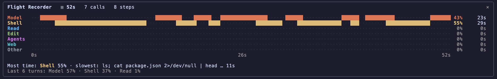

# Claude Code mods

Mods for [Claude Code](https://claude.com/claude-code) (2.1.287 or later).

## Flight Recorder

Where did that 4-minute turn go? Type `/flight` and watch it: one row per kind of work (the model, shell commands, reading, editing, sub-agents, web, everything else) paints live while Claude works. When the turn ends you get the split, the slowest single call, and a running total over your last 20 turns.



Install:

```
/plugin marketplace add robertiuoras/claude-mods
/plugin install flight-recorder@robertiuoras
```

Then type `/flight`. More in [flight-recorder/README.md](flight-recorder/README.md).

MIT licensed.
